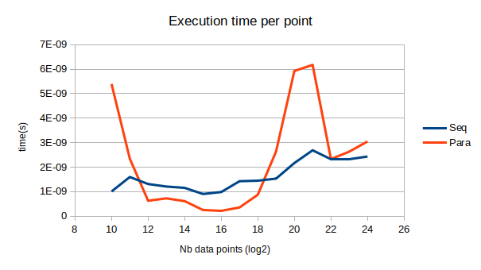
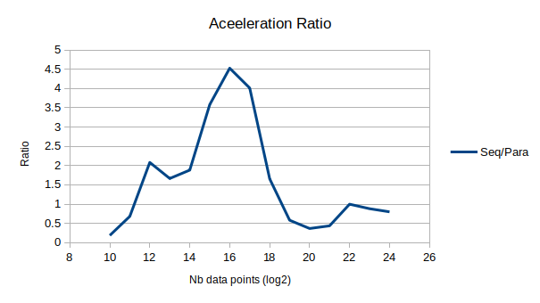
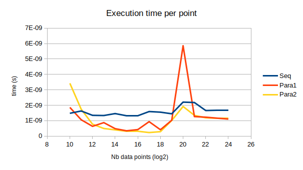
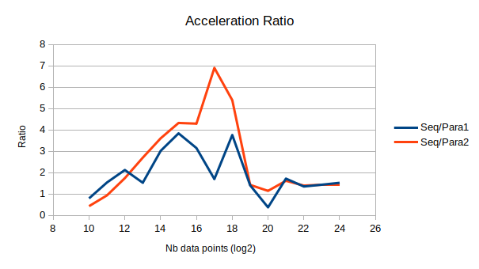
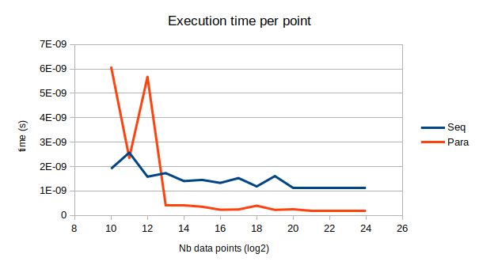
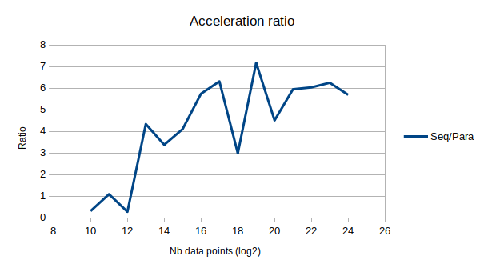
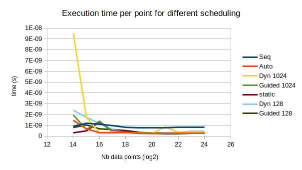
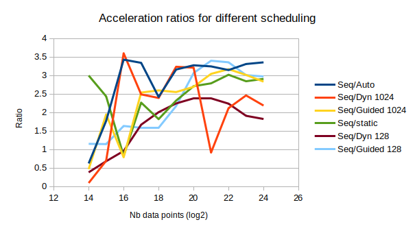
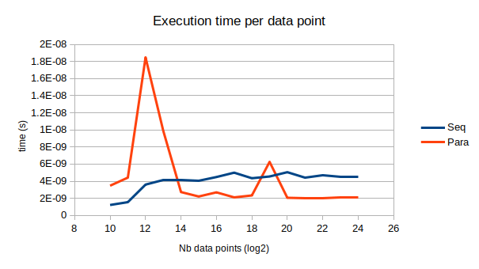
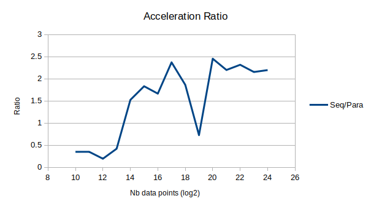

# Rapport Programmation Parallèle TP 2

## I - Introduction

### Config

Pour réaliser ce TP, if faut une version récente de GCC supportant les dernière instructions OpenMP, ainsi qu'un import pour accéder ou routines préprocésseurs de OpenMP:

```C
#include <omp.h> 
```

Usage:  `make clean && make && ./openmp.run [path to image for ex 4]`

Fichiers: `openmp.(cpp/h), csv.(cpp/h),  container.(cpp/hpp), ios.(cpp/hpp), pixmap_io.(cpp/hpp) and global_paramters.hpp`

Options de compilation standard: `-O3 -w -std=c++17 -march=native -fopenmp -fno-tree-vectorize`  
(J'ai désactivé l'autovectorisation pour observer les performances pures du multithreading ainsi que les warning générés par le code de Sobel fourni par le professeur)


Pour sauvegarder le benchmarking sous format csv, il suffit de définir la variable `SAVE_BENCH` avec le flag `-DSAVE_BENCH` ou 
```C
#define SAVE_BENCH
```
Le code qui génère les fichiers csv se trouve dans `csv.(cpp/hpp)

De manière similaire pour sauvegarder les resultats du filtre de Sobel : `-DSAVE_IMG`

Chaque exercice (1,2,3,5) peut être choisi à compiler ou non avec les Variables `EX1, EX2, EX3, EX5` à définir.

(Toutes ces variables sont [dé]-commentables dans le Makefile fourni)

### Fonctionnement

OpenMp fonctionne de manière assez simple, en utilisant des `#pragma` qui indiques les portions de code à paralléliser.

Dans ce TP, nous allons observer les différences d'execution entre de la parallélisation avec peu de threads (1 ou séquentiel) et beaucoup de threads (généralement 8), mais également l'influence de la taille des données sur le temps de calcul (selon si elles se trouvent dans le cache du CPU ou dans la RAM).

Seul l'exercice 4 ne voit pas sa taille de données modifiée (Car appliqué sur des vrais fichiers d'image).

Tout les prototypes et les variables préprocesseurs sont définies dans le fichier header associé.

Les vecteurs d'input sont pour tout les exercices remplis de manière pseudo aléatoire par les PRNG suivant:

```C
srand(time(NULL));

float rand_float(){
    return (float)((rand() % 360) - 180.0);
}

int rand_int(){
    return (int)((rand() % 360) - 180);
}
```

Pour chaque fonction, le temps d'execution est mesuré en utilisant la fonction `omp_get_wtime()`.

Les becnhmark effectués qui ont aidé à générer les graphiques sont fournis avec ces même graphiques dans le dossier `bench`.

## Moyenne de 2 vecteurs

### Code séquentiel (openmp.c L237 - fonction `exercice1_seq` )
```C
for ( int i = 0; i < size; i++){
    res[i] = (vec1[i] + vec2[i])/2;
}
```

### Code parallèle (openmp.c L230 - fonction `exercice1_omp` )

```C
#pragma omp parallel for
for ( int i = 0; i < size; i++){
    res[i] = (vec1[i] + vec2[i])/2;
}
```

### Instructions OpenMP
- `#pragma omp parallel for` : parallélise la prochaine boucle for avec les option de scheduling par defaut

### Performances 

Benchmark sur ordinateur portable 
- CPU: Intel(R) Core(TM) i7-6700HQ CPU @ 2.60GHz
- Moyenne sur 1000 itération 
- Parallèlisation sur 8 threads

|                             |                          |
|-----------------------------|--------------------------|
| |  |

---

## Produit Scalaire de 2 vecteurs

Remarque: on peut observer  dans la version séquentielle et la version parallèle avec réduction la présence d'un booléen `imbalanced` qui sert à déséquilibrer le travail des threads.  
Ce code sera utilisé pour l'exercice 3.

### Code séquentiel (openmp.c L272 - fonction `exercice2_seq` )
```C
double res = 0;
for ( int i = 0; i < size; i++){
    if(imbalanced == false)
            res += vec1[i] * vec2[i];
    else {
        if((i < size/20) || (i > size-size/20)){
            res += vec1[i] * vec2[i];
        }
    }
}
return res;
```

### Code parallèle sans réduction (openmp.c L243 - fonction `exercice2_omp_no_red` )

```C
double res[8] = {0,0,0,0,0,0,0,0};
#pragma omp parallel for
for ( int k = 0; k < 8; k++ ){
    for ( int i = 0; i < size/8; i++){
        res[k] += vec1[i+k*size/8] * vec2[i+k*size/8];
    }
}
return res[0]+res[1]+res[2]+res[3]+res[4]+res[5]+res[6]+res[7];
```

### Code parallèle avec réduction (openmp.c L255 - fonction `exercice2_omp_red` )

```C
double res = 0;
#pragma omp parallel
{
    #pragma omp for reduction(+:res) schedule(auto)
    for ( int i = 0; i < size; i++){
        if(imbalanced == false)
            res += vec1[i] * vec2[i];
        else {
            if(i < size/20 || i > size-size/20)
                res += vec1[i] * vec2[i];
        }
    }
}
return res;
```

### Instructions OpenMP

- `#pragma omp parallel for` : parallélise la prochaine boucle for avec les option de scheduling par defaut

- `#pragma omp parallel { <code to parallelize> }` : sert à déclarer un bloc de code à paralléliser.

- `#pragma omp for reduction(+:<reduction accumulator>) schedule(<schduling policy>, <chunk size>)`: Parallélise une boucle for pour une réduction dont on précise l'accumulateur. On doit ensuite spécifier le mode de scheduling et pour certains modes, la chunk size (auto, static, dynamic + chunk size, guided + chunk size).

### Performances 

Benchmark sur ordinateur portable 
- CPU: Intel(R) Core(TM) i7-6700HQ CPU @ 2.60GHz
- Moyenne sur 1000 itération 
- Parallèlisation sur 8 threads
- Para1 : sans réduction
- Para2 : avec réduction

|                             |                          |
|-----------------------------|--------------------------|
| |  |

(On peut observer un pic de temps d'execution à 2^20 car étant sur un ordinateur portable, et faisant le benchmark sur l'intégralité de mes 8 threads, il se peut qu'il ait été perturbé par une tâche système)

---


## Produit scalaire déséquilibré

Pour cet exercice, nous utilisont les deux codes (séquentiel et parallèle avec réduction) de l'exercice précedent avec les variable `imbalanced` à `true` afin de déséquilibrer l'occupation des threads.  
On ne traite donc que 10% des données (5% à gauche et 5% à droite du vecteur)

Benchmark sur ordinateur portable 
- CPU: Intel(R) Core(TM) i7-6700HQ CPU @ 2.60GHz
- Moyenne sur 1000 itération 
- Parallèlisation sur 8 threads

Tout d'abord, regardons l'execution séquentielle et parallèle avec le mode de scheduling `auto`:

|                             |                          |
|-----------------------------|--------------------------|
| |  |

On peut observer que la forme en cloche est bien présente (même si des pics apparaissent de temps en temps du aux spécifications et à l'utilisation de la machine hôte).

Observons maintenant les impact des différents modes de scheduling:

|                             |                          |
|-----------------------------|--------------------------|
| |  |

Même si les modes `guided` et `static` sont assez proches des meilleirs performances, on observe que globalement le mode `auto`  reste le meilleur (Merci aux développeurs de GCC :D). Le mode dynamique reste cependant globalement (sauf à taille de donnée moyenne pour chunk de taille 1024)


## Dérivée d'une image (Filtre de Sobel)

Pour la dérivée de l'image, j'utilise le code fournis par le professeur qui sert à charger une image et à la transformer en pixel map. 
Pour cela il faut importer les fichier suivants:
```C
#include "container.hpp"
#include "global_parameters.hpp"
#include "ios.hpp"
```
Et avoir les fichiers:
- `container.(cpp/hpp)`
- `ios.(cpp/hpp)`
- `global_parameters.hpp`
- `pixmap_io.(cpp/hpp)`

Il faut pour faire fonctionner cet exercice passer un fichier image `.pgm` en argument de l'executable généré par le makefile:

`./openmp.run ../../03-OpenMP_Image/images/Drone.pgm`

Avec le flag `SAVE_IMG` activé, cela sauvegarrdera deux fichiers; Sobel_seq.pgm et Sobel_para.pgm.

Le code qui gère les images et appelle les fonction à benchmark se trouves entre les lignes 20 et 69 de `openmp.c` dans la fonction `main`.

### Code séquentiel (openmp.c L299 - fonction `exercice4_seq` )
```C
for (auto i = 1; i < height-1; i++) {
    for (auto j = 1; j < width-1; j++) {
        if ((i==0)||(i==height-1)||(j==0)||(j==width-1)) {Resultat[i][j]=0;}
        else {
            Resultat[i][j]  = std::abs(Source[i-1][j-1] + Source[i-1][j] + Source[i-1][j+1] - (Source[i+1][j-1] + Source[i+1][j] + Source[i+1][j+1]));
            Resultat[i][j] += std::abs(Source[i-1][j-1] + Source[i][j-1] + Source[i+1][j-1] - (Source[i-1][j+1] + Source[i][j+1] + Source[i+1][j+1]));
        }
    }
}
```

### Code parallèle (openmp.c L286 - fonction `exercice4_omp` )

```C
#pragma omp parallel for
for (auto i = 1; i < height-1; i++) {
    for (auto j = 1; j < width-1; j++) {
        if ((i==0)||(i==height-1)||(j==0)||(j==width-1)) {Resultat[i][j]=0;}
        else {
            Resultat[i][j]  = std::abs(Source[i-1][j-1] + Source[i-1][j] + Source[i-1][j+1] - (Source[i+1][j-1] + Source[i+1][j] + Source[i+1][j+1]));
            Resultat[i][j] += std::abs(Source[i-1][j-1] + Source[i][j-1] + Source[i+1][j-1] - (Source[i-1][j+1] + Source[i][j+1] + Source[i+1][j+1]));
        }
    }
}
```

### Instructions OpenMP

On utilise simplement le `#pragma omp parallel for` sur le code séquentiel afin de paralléliser par lignes de l'image.

### Performances

Benchmark sur ordinateur portable 
- CPU: Intel(R) Core(TM) i7-6700HQ CPU @ 2.60GHz
- Moyenne sur 1000 itération 
- Parallèlisation sur 8 threads

<center>

|  size\time(s) | Séquentiel |  Parallèle  | Ratio  |
|---------------|------------|-------------|--------|
| (720x480)     | 0.00129237 | 0.000504822 | 2.56   |
| (4000x2667)   | 0.039715   | 0.0125371   | 3.1678 |
</center>


Résultat du filtrage de Sobel


--- 

## Création d'une sous-liste

### Code séquentiel (openmp.c L311 - fonction `exercice5_seq` )
```C
for(int i = 0; i < size; i++){
    if(list[i] % 2 == 0){
        even_sublist[*counter] = list[i]; 
        (*counter)++;
    }
}
```

### Code parallèle (openmp.c L320 - fonction `exercice5_omp` )

```C
*counter = 0;
// We split the source list in n_threads batchs of equal sizes
int* tmp_sublist = (int*)calloc(size, sizeof(int));
int counters[n_threads];
int batch_size = size/n_threads;

// Each thread process its batch and store it in a reserved 
// space of the destination list and increment a counter for each 
// thread
#pragma omp parallel for
for( int i = 0; i < n_threads; i++){
    counters[i] = 0;
    for(int j = 0; j < batch_size; j++){
        if( list[i*batch_size + j] % 2 == 0 ){
            tmp_sublist[i*batch_size+j] = list[i*batch_size+j];
            counters[i]++;
        }
    }
}

// We merge the sublists into one
for(int k=0; k < n_threads; k++){
    for(int l=0; l < counters[k]; l++){
        even_sublist[(*counter)+l] = tmp_sublist[k*batch_size+l]; 
    }
    (*counter)+= counters[k];
}
free(tmp_sublist);
```

Remarque: comme on connait le nombre d'élement dans chaque sublist grâce au tableau counter, on pourrait paralléliser le merge, mais le gain de performance serait minime.

### Instructions OpenMP

On utilise l'instruction `#pragma omp parallel for` afin de paralléliser la recherche d'élément.

### Performances

Benchmark sur ordinateur portable 
- CPU: Intel(R) Core(TM) i7-6700HQ CPU @ 2.60GHz
- Moyenne sur 1000 itération 
- Parallèlisation sur 8 threads

|                             |                          |
|-----------------------------|--------------------------|
| |  |

(On a un pic de baisse de performance à 2^19 surement dû aux même raisons que précédemment car tout les benchmark sont effectués en même temps à quelques secondes d'écart)

## Remarques générales

Pour les exercices 2, 3 et 5, on peut observer un début de forme en cloche dans les ratio d'accélération séquentiel/parallèle. Mais on observe pas la "fin" de la cloche (diminution de la performance) car il se peut que 2^24 ne spoit pas une taille de donnée suffisement grand pour voir une diminution sur ces algorithmes.

