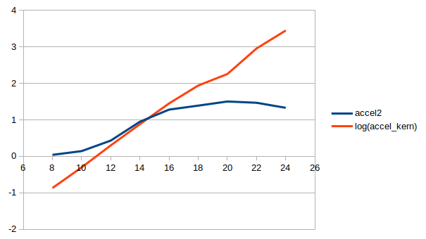

# Rapport Programmation Parallèle TP 3

## I - Introduction

### Materiel

CPU :
- Intel(R) Core(TM) i7-6700HQ CPU @ 2.60GHz
- 8 Cores

GPU :
- Nvidia Geforce GTX 970M
- 1280 Cuda Cores
- GPU Clock 924MHz + Boost
- Memory : 3024MiB GDDR5, 2500 MHz

### Config

Pour réaliser ce TP, if faut une version récente de GCC supportant les dernière instructions OpenMP, une carte graphique Nvidia avec un pilote graphique à jour (390.116 sur GeForce GTX 970M dans le cas de ma machine). Il faut egalement installer le paquet `nvidia-cuda-toolkit` sur Linux qui fournit la dernière version de cuda disponible pour le Driver installé (9.1 à l'heure actuelle).

```C
#include "cuda_runtime.h"
#include "cuda.h"
#include "omp.h"
#include "device_launch_parameters.h"
```
Build : `make clean && make`

Usage : `./tpcuda.run [path to image] [number of iterations]`

Fichiers : `main.(cu/cuh), utils.(cu/h), dotp.(cu/cuh), sobel.(cu/cuh), transpo.(cu/cuh), histo.(cu/cuh), container.(cu/cuh), ios.(cu/cuh), pixmap_io.(cu/cuh) and global_paramters.cuh`

Le compilateur utilisé est `nvcc` (Nvidia C Compiler) avec les options de compilation suivantes :
`-ccbin g++-6 -gencode arch=compute_50,code=sm_50 -I /usr/local/cuda/include -std=c++11 -Xcompiler -fopenmp -O3 -Iinclude`


### Fonctionnement

Dans ce TP, nous allons paralléliser des programmes de traitements d'images sur GPU en utilisant Nvidia CUDA Toolkit 9.1.

Pour utiliser cuda, il faut importer les headers suivants:
```C
#include "cuda_runtime.h"
#include "cuda.h"
#include "device_launch_parameters.h"
```
Il faut utiliser l'extension `.cu` au lieu de `.cpp` et `.cuh` au lieu de `.h`.

Pour executer du code sur le gpu, on doit créer un fonction appelée `kernel` qu'on déclare ainsi:

```C
__global__ void kernel(args){}
```
Dans ce kernel, on va utiliser plusieurs nouveaux mots clés :

- `__shared__ type variable[size]` : Déclaration d'un tableau dans la mémoire partagée du GPU
- `blockIdx`, `blockDim`, `threadIdx` : Variables permettant au kernel de connaitre des informations positionnelles dans le GPU
- `atomidAdd(&acc, val)` : ajoute la valeur `val` à l'accumulateur `acc` de manière atomique (thread safe)
- `__syncthreads()` : fonction pour synchroniser les threads d'un block

Ce kernel sera appelé avec des blocks contenant chacun un certain nombre de threads. Ces deux paramètres sont passé au kernel ainsi et sont de type `dim3`:

```C
// nombre d'argument de 1 à 3 pour le nombre de dimensions
dim3 blocks(args) // ex: block(10,10)
dim3 threads(args2) // threads(32,32)
kernel<<<blocks,threads>>>(args)
```

Les données envoyés au kernel (si elles ne sont pas de types atomiques comme `int` ou `unsigned`) doivent être alloués dans le mémoire du GPU en utilisant les fonctions suivantes:

```C
// On alloue srcCuda et resCuda dans la mémoire du GPU
cudaMalloc(&srcCuda, size)
cudaMalloc(&rescuda, size)

// On copie nos données dans cette variable
cudaMemcpy(srcCuda, source, size, cudaMemcpyHostToDevice)

// On appelle le kernel avec n blocks de k threads
kernel<<<n,k>>>(srcCuda, resCuda, other_args...)

// On récupère le résultat dans une variable CPU
cudaMemcpy(res, resCuda, size, cudaMemcpyDeviceToHost)

// On libère la mémoire du GPU
cudaFree(srcCuda)
cudaFree(resCuda)
```

Pour le premier exercice, on utilise un PRNG pour remplir les vecteurs.

```C
srand(time(NULL));

float rand_float(){
    return (float)((rand() % 360) - 180.0);
}
```
Pour les exercices suivants on peut utiliser les images présentes dans le dossier `images` dont les résultats modifiés sont sauvegardés dans le dossier `images/Résultats`.

Pour chaque fonction, le temps d'execution est mesuré en utilisant la fonction `omp_get_wtime()`.

Les becnhmark effectués qui ont aidé à générer les graphiques sont fournis avec ces même graphiques dans le dossier `bench`.

Tout les codes CPU sont parallélisés sur 8 threads en utilisant OpenMP.

Afin de profilé l'utilisation du GPU, je vais utiliser `nvprof` (l'outils en cli derrière `nvvp` qiu est moins visuel mais avec des résultats plus simples à visualiser considérant le fait que j'itère beaucoup de fois et que le profiler fait le programme complet, les résultats ne sont donc pas très visuels)

## II - Produit Scalaire de 2 vecteurs

Dans le code CUDA, on utilise une variable locale qui va contenir le produit partiel, et on utilise `atomicAdd` pour ajouter ce resultat de manière thread safe au résultat global.

### Code source (src/1-dotp/dotp.cu)

```C
__global__ void gpu_dotp_kernel(int size, float* vec1, float* vec2, float* res){

    float cache = 0;
    int i = blockIdx.x * blockDim.x + threadIdx.x;

    if( i < size ){
        cache = vec1[i]*vec2[i];
    }

    atomicAdd(res, cache);
}

float cpu_dotp(float* vec1, float* vec2, int size){
    int res = 0;
    #pragma omp parallel num_threads(8)
    {
        #pragma for reduction(+:res) schedule(auto)
        for( int i = 0; i < size; i++ ){
            res+= vec1[i]*vec2[i];
        }
    }
    return res;
}
```

### Performances

Benchmark sur 1000 itérations:

| Data Size   | GPU Kernel Acceleration | GPU Total Acceleration |
|-------------|-------------------------|------------------------|
| 16 x 16     |        0.135448         |        0.0407969       |
| 32 x 32     |        0.497353         |        0.142652        |
| 64 x 64     |        1.99547          |        0.431701        |
| 128 x 128   |        7.60698          |        0.948662        |
| 256 x 256   |        28.2657          |        1.28158         |
| 512 x 512   |        87.3893          |        1.39062         |
| 1024 x 1024 |        180.303          |        1.50325         |
| 2048 x 2048 |        905.526          |        1.46826         |
| 4096 x 4096 |        2814.33          |        1.32986         |

On peut observer que le kernel accélere de manière exponentielle en fonction de la taille de la donnée, mais que le temps d'exeuction total reste relativement borné:



Cela s'explique simplement quand on regarde le profil d'execution GPU:
```
GPU activities:   65.94%  54.4803s      1000  54.480ms  54.480ms  54.490ms  gpu_dotp_kernel(int, float*, float*, float*)
                  34.05%  28.1340s      2000  14.067ms  13.018ms  32.907ms  [CUDA memcpy HtoD]
                   0.00%  1.2704ms      1000  1.2700us  1.2160us  2.9120us  [CUDA memcpy DtoH]
     API calls:   88.55%  82.9214s      3000  27.640ms  13.142ms  54.622ms  cudaMemcpy
                  10.47%  9.80090s      3000  3.2670ms  180.48us  6.8577ms  cudaFree
                   0.92%  862.85ms      3000  287.62us  95.322us  96.786ms  cudaMalloc
                   0.06%  57.378ms      1000  57.377us  46.292us  251.46us  cudaLaunch
                   0.00%  2.1361ms      1000  2.1360us     900ns  15.531us  cudaConfigureCall
                   0.00%  1.6680ms      4000     417ns     132ns  14.679us  cudaSetupArgument
                   0.00%  562.96us        94  5.9880us     908ns  218.99us  cuDeviceGetAttribute
                   0.00%  101.57us         1  101.57us  101.57us  101.57us  cuDeviceTotalMem
                   0.00%  70.909us         1  70.909us  70.909us  70.909us  cuDeviceGetName
                   0.00%  6.6220us         3  2.2070us     991ns  3.2050us  cuDeviceGetCount
                   0.00%  3.9140us         2  1.9570us  1.2370us  2.6770us  cuDeviceGet
```

On observe en effet que les call API `cudaMemcpy` prennent la grande majorité du temps d'execution total. On est borné en execution par les accès mémoire.


On voit ici le log10 des temps d'execution en fonction de la taille des données: on observe bien une sorte de barrière à 10e-9s qui est le temps d'accès à la mémoire.


### Remarques

Parfois le résultat du CPU et du GPU étaient différents :

```
Dotp vec size : 16777216
Image Dimensions: 720x480
Exercice 1 : Dot Product
====================================
Cpu dot prod: -368561
Gpu dot prod: -369235
Absolute Error: 674

Dotp vec size : 4194304
Image Dimensions: 720x480
Exercice 1 : Dot Product
====================================
Cpu dot prod: -4.59882e+06
Gpu dot prod: -4.59886e+06
Absolute Error: 43

Dotp vec size : 1048576
Image Dimensions: 720x480
Exercice 1 : Dot Product
====================================
Cpu dot prod: 1.5272e+07
Gpu dot prod: 1.52721e+07
Absolute Error: 81
```

Je ne saurai pas expliquer d'ou proviens cette différence de résultat, mais cela reste un problème. (Peut être des erreurs de conversion de types ou d'arrondi de nombre à virgule flottante)


## III - Filtre de Sobel

*Ce code a été fourni par le professeur M. Cabaret*

### Code Source (src/2-sobel/sobel.cu)

```C
__global__ void gpu_sobel_kernel_naive(u_char *Source, u_char *Resultat, unsigned width, unsigned height) {
    int j = blockIdx.x*blockDim.x + threadIdx.x;
    int i = blockIdx.y*blockDim.y + threadIdx.y;
    u_char val;
    int globalIndex = i*width+j;
    if ((i==0)||(i>=height-1)||(j==0)||(j>=width-1)) {Resultat[globalIndex]=0;}
    else {
        val  = std::abs(Source[(i-1)*width+(j-1)] + Source[(i-1)*width+(j)] + Source[(i-1)*width+(j+1)] -\
                       (Source[(i+1)*width+(j-1)] + Source[(i+1)*width+(j)] + Source[(i+1)*width+(j+1)]));
        Resultat[globalIndex]  = val + std::abs(Source[(i-1)*width+(j-1)] + Source[(i)*width+(j-1)] + Source[(i+1)*width+(j-1)] -\
                                             (Source[(i-1)*width+(j+1)] + Source[(i)*width+(j+1)] + Source[(i+1)*width+(j+1)]));

    }
}

__global__ void gpu_sobel_kernel_shared(u_char *Source, u_char *Resultat, unsigned width, unsigned height) {
    __shared__ u_char tuile[BLOCKDIM_X][BLOCKDIM_Y];
    
    int x = threadIdx.x;
    int y = threadIdx.y;
    int i = blockIdx.y*(BLOCKDIM_Y-2) + y;
    int j = blockIdx.x*(BLOCKDIM_X-2) + x;
    
    int globalIndex = i*width+j;

    if ((i==0)||(i>=height-1)||(j==0)||(j>=width-1)) {}
    else {            
        //mainstream    
        tuile[x][y] = Source[globalIndex];
        __syncthreads();

        u_char val;
        if ((x>0)&&(y>0)&&(x<BLOCKDIM_X-1)&&(y<BLOCKDIM_Y-1)) {
            val = std::abs(tuile[x-1][y-1] + tuile[x-1][y] + tuile[x-1][y+1] -\
                          (tuile[x+1][y-1] + tuile[x+1][y] + tuile[x+1][y+1]));
            Resultat[globalIndex]  = val + std::abs(tuile[x-1][y-1] + tuile[x][y-1] + tuile[x+1][y-1] -\
                                                   (tuile[x-1][y+1] + tuile[x][y+1] + tuile[x+1][y+1]));
        }
    }    
}

void cpu_sobel(u_char **Source, u_char **Resultat, unsigned width, unsigned height) {
    #pragma omp parallel for num_threads(8)
    for (auto i = 1; i < height-1; i++) {
        for (auto j = 1; j < width-1; j++) {
            if ((i==0)||(i==height-1)||(j==0)||(j==width-1)) {Resultat[i][j]=0;}
            else {
                Resultat[i][j]  = std::abs(Source[i-1][j-1] + Source[i-1][j] + Source[i-1][j+1] - (Source[i+1][j-1] + Source[i+1][j] + Source[i+1][j+1]));
                Resultat[i][j] += std::abs(Source[i-1][j-1] + Source[i][j-1] + Source[i+1][j-1] - (Source[i-1][j+1] + Source[i][j+1] + Source[i+1][j+1]));
            }
        }
    }
}
```

### Performances

Les performances sont mesurées sur 1000 itérations.
L'échelle de droite des graphiques représente le log4 de la taille des images (width*height).


*n_k = naive kernel, n_t = naive total, s_k = shared kernel, s_t = shared total*

On peut observer que le temps d'execution du cpu est constant peut importe la taille de l'image, mais on observe comme précédemment que le kernel est bien plus rapide sur des données de tailles plus grandes.

Cependent on observe toujours le bottlebeck à 10e-9s qui est le temps d'accès mémoire.

En regardant les statistiques du GPU données par nvprof, on obtient par exemple sur `Drone_Huge.png`:

```console
==24064== Profiling application: exe/tpcuda.run ./images/Drone_huge.pgm 1000
==24064== Profiling result:
            Type  Time(%)      Time     Calls       Avg       Min       Max  Name
 GPU activities:   38.80%  4.05111s      2000  2.0256ms  1.9781ms  5.4397ms  [CUDA memcpy DtoH]
                   38.33%  4.00210s      2000  2.0010ms  1.9278ms  5.3910ms  [CUDA memcpy HtoD]
                   12.08%  1.26123s      1000  1.2612ms  1.2507ms  1.2710ms  gpu_sobel_kernel_shared(unsigned char*, unsigned char*, unsigned int, unsigned int)
                   10.79%  1.12621s      1000  1.1262ms  1.1202ms  1.1406ms  gpu_sobel_kernel_naive(unsigned char*, unsigned char*, unsigned int, unsigned int)
      API calls:   78.15%  11.0169s      4000  2.7542ms  1.9893ms  7.2746ms  cudaMemcpy
                   13.29%  1.87395s      3000  624.65us  120.33us  1.1149ms  cudaFree
                    8.08%  1.13874s      3000  379.58us  102.15us  114.38ms  cudaMalloc
                    0.44%  62.497ms      2000  31.248us  14.094us  427.70us  cudaLaunch
                    0.01%  2.0914ms      8000     261ns      98ns  19.927us  cudaSetupArgument
                    0.01%  1.9170ms      2000     958ns     275ns  13.884us  cudaConfigureCall
                    0.00%  430.74us        94  4.5820us     563ns  180.21us  cuDeviceGetAttribute
                    0.00%  77.678us         1  77.678us  77.678us  77.678us  cuDeviceTotalMem
                    0.00%  47.486us         1  47.486us  47.486us  47.486us  cuDeviceGetName
                    0.00%  4.0300us         3  1.3430us     736ns  2.4360us  cuDeviceGetCount
                    0.00%  2.2380us         2  1.1190us     741ns  1.4970us  cuDeviceGet
```

On voit tout de suite que les temps de transfert de données d'accès à la mémoire sont le bottleneck de ce programme.

Cependant, on peut tout de même observer une accélération significative de l'execution du programme:


(Les échelles sont en log10, donc on obtient des accélération réelles entre 20 et 40, voir `bench/sobel.csv`)

### Résultats

*Example sur mona_lisa.pgm*

| CPU | GPU | GPU Shared |
|-|-|-|
| |  |  |
 
On observe des lignes noires sur certains bords qui sont dues au fait que il n'y a pas assez de block pour couvrir l'intégralité de l'image (à 
modifier dans le code dans la déclaration de `dim3 blocks`)

Le résultat en shared présente aussi des résultats étranges sur les bords (pixels blancs/noirs) qui sont dues au fait qu'on utilise de la mémoire partagée.

## IV - Transposée d'une image

### Code Source (src/3-transpo/transpo.cu)

```C
__global__ void gpu_transpo_kernel_naive(u_char *Source, u_char *Resultat, unsigned width, unsigned height){
    int j = blockIdx.x*blockDim.x + threadIdx.x;
    int i = blockIdx.y*blockDim.y + threadIdx.y;

    if ((i<0)||(i>=height)||(j<0)||(j>=width)) {}
    else {
        Resultat[j*height + i]  = Source[i*width + j];
    }
}

__global__ void gpu_transpo_kernel_shared(u_char *Source, u_char *Resultat, unsigned width, unsigned height) {
    __shared__ u_char tuile[BLOCKDIM_X][BLOCKDIM_Y+1];
    
    int x = threadIdx.x;
    int y = threadIdx.y;
    int i = blockIdx.y*(BLOCKDIM_Y) + y;
    int j = blockIdx.x*(BLOCKDIM_X) + x;
    

    if ((i<0)||(i>=height)||(j<0)||(j>=width)) {}
    else {            
        //mainstream    
        tuile[y][x] = Source[i*width + j];
        __syncthreads();
        int i = blockIdx.y*(BLOCKDIM_Y) + x;
        int j = blockIdx.x*(BLOCKDIM_X) + y;
        Resultat[j*height + i] = tuile[x][y];
    }    
}

void cpu_transpo(u_char **Source, u_char **Resultat, unsigned width, unsigned height){
    #pragma omp parallel for num_threads(8)
    for (unsigned i = 0; i < height; i++) {
        for (unsigned j = 0; j < width; j++) {
            Resultat[j][i]  = Source[i][j];
        }
    }
}
```

### Performances

## V - Histogramme d'une image en niveau de gris

### Code Source (src/4-histo/histo.cu)

```C
__global__ void gpu_histo_kernel_naive(u_char* Source, int *res, unsigned height, unsigned width){
    int j = blockIdx.x*blockDim.x + threadIdx.x;
    int i = blockIdx.y*blockDim.y + threadIdx.y;
    if ((i<0)||(i>=height)||(j<0)||(j>=width)) {}
    else {
        u_char val = Source[i*width+j];
        atomicAdd(&res[val],1);
    }
}

__global__ void gpu_histo_kernel_shared(u_char* Source, int *res, unsigned height, unsigned width){
    __shared__ int hist[256];

    int j = blockIdx.x*blockDim.x + threadIdx.x;
    int i = blockIdx.y*blockDim.y + threadIdx.y;

    int index = threadIdx.x * BLOCKDIM_X + threadIdx.y;

    if( index < 256) {
        hist[index] = 0;
    }
    __syncthreads();


    if ((i<0)||(i>=height) || (j<0) || (j>=width)) {}
    else {
        atomicAdd(&hist[Source[i*width+j]], 1);
        __syncthreads();
        if( index < 256)
            atomicAdd(&res[index], hist[index]);
    }
}

void cpu_histo(u_char** Source, int (*res)[256], unsigned height, unsigned width){
    #pragma omp parallel for num_threads(8)
    for( int i = 0; i < height; i++){
        for( int j = 0; j < width; j++){
            #pragma omp atomic
            (*res)[Source[i][j]]++;
        }
    }
}
```

### Performances
